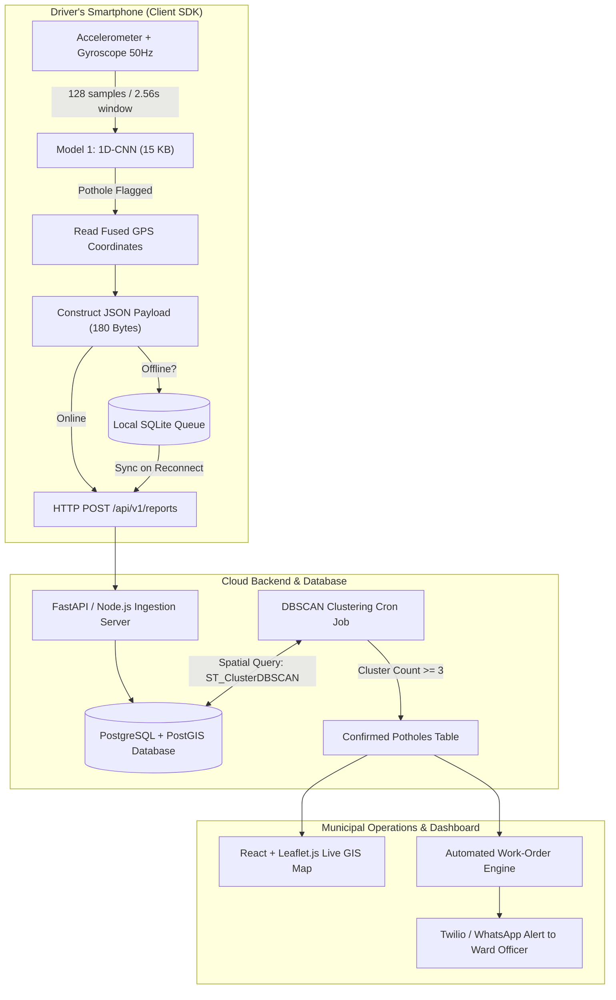

# Crowdsourced Pothole Detection & Municipal Work-Order Automation
## Complete Project Master Summary (`summary1.md`)

---

## 1. Project Overview & Problem Statement

* **The Problem:** Indian roads suffer from millions of potholes causing thousands of fatal road accidents annually (over 9,400+ deaths officially recorded from 2020–2024). Municipal corporations rely on slow, manual inspections or reactive citizen complaints that often take weeks or months to be resolved.
* **The Solution:** A crowdsourced road monitoring system running quietly inside existing delivery/ride-hailing driver apps (e.g., Swiggy, Zomato, Ola, Uber, Rapido). 
  * As drivers ride with their dashboard/handlebar-mounted phones, the phone's **motion sensors (accelerometer & gyroscope)** detect the mechanical impact of potholes, record GPS coordinates, and stream lightweight data pings.
  * The backend clusters multiple vehicle reports at the exact same location using **DBSCAN spatial clustering** to confirm true road damage and filter out false alarms (e.g. phone drops or speed bumps).
  * Confirmed potholes appear on a live **Municipal GIS Dashboard** (heatmaps & status pins) and automatically generate **Open311/REST work orders** sent directly to road contractors and ward engineers via SMS/WhatsApp.
* **Feasibility Score: 8.5 / 10** (Proven approach; validated by Microsoft Research India's *Nericell* project, Michelin's acquisition of *RoadBotics*, and Indian Smart City pilots in Pune, Surat, and Ahmedabad).

---

## 2. System Architecture & End-to-End Data Flow



### The 4 Core Layers:
1. **Edge Client (Driver App):** Runs in the background, extracts sensor windows, classifies road surface jolts locally in $<1\text{ ms}$, tags GPS, and sends tiny JSON pings (~180 bytes).
2. **Ingestion Server:** High-throughput API gateway (FastAPI/Node.js) protected by a message queue (Kafka/Redis) to handle rush-hour spikes.
3. **Spatial Intelligence Engine:** PostgreSQL + PostGIS database executing DBSCAN spatial clustering to group reports within a 5-meter radius and eliminate random sensor noise.
4. **Municipal Web Portal:** Interactive GIS dashboard (React + Leaflet/Deck.gl) with automated ticketing, SLA tracking, and instant alerts.

---

## 3. The Two-Model Architecture Strategy

To make the app run on **98%+ of all smartphones in India** without draining battery, heating phones, or consuming user mobile data, the intelligence is split into two specialized models:

```
┌─────────────────────────────────────────────────────────────────────────────┐
│                             TWO-MODEL STRATEGY                              │
├──────────────────────────────────────┬──────────────────────────────────────┤
│ MODEL 1: Tiny Sensor Model (On Phone)│ MODEL 2: Vision Model (On Server)    │
├──────────────────────────────────────┼──────────────────────────────────────┤
│ • Type: 1D-CNN (Time-Series)         │ • Type: YOLOv11-Small (Vision)       │
│ • Input: 6-Axis Accel + Gyro         │ • Input: Road Photos / Dashcam video │
│ • Size: ~12 to 15 KB (INT8)          │ • Size: ~22 MB (TFLite/ONNX)         │
│ • RAM Usage: < 100 KB                │ • Execution: Server GPU / Verification│
│ • Inference: < 1 millisecond         │ • Accuracy: ~85-88% mAP@50 (Potholes)│
│ • Bandwidth: 180 bytes per report    │ • Purpose: Visual verification audit │
└──────────────────────────────────────┴──────────────────────────────────────┘
```

---

## 4. Hardware Feasibility & Phone Market Compatibility

### Phone Compatibility in India (Model 1):
* **Model Size:** 15 KB (Smaller than a single WhatsApp profile photo).
* **RAM footprint:** $<100\text{ KB}$ (Less RAM than an emoji keyboard).
* **Target Audience:** Even entry-level Indian phones ($2\text{ GB}$ to $4\text{ GB}$ RAM, Android 10+) run this effortlessly without background stutter or battery drain.
* **Installed App Footprint:**
  * Base App + UI + GPS: ~12 MB
  * TFLite C++ Runtime: ~3 MB
  * Sensor AI Model: **0.015 MB**
  * SQLite Cache: ~2 MB
  * **Total Installed Size:** **~30 to 45 MB** (Lighter than WhatsApp or Instagram).

### Training Hardware Specs (Your Laptop):
* **Hardware:** 16GB RAM, NVIDIA RTX 4060 Laptop GPU (8GB VRAM), 1TB SSD.
* **Model 1 (1D-CNN):** Trains locally in **under 2 minutes**.
* **Model 2 (YOLOv11-Small on 50K images):**
  * Training Time: **~2.5 hours** for 50 epochs on RTX 4060 with Mixed Precision (`amp=True`).
  * VRAM Consumption: **~3.5 GB** (easily fits within 8 GB VRAM at `batch=16`).
  * Accuracy: **~82%–88% mAP@50** for potholes specifically.

---

## 5. The Complete Tech Stack

| Layer | Primary Tech | Why Chosen / Purpose |
| :--- | :--- | :--- |
| **Mobile SDK** | Kotlin (Android) / Flutter | Direct access to hardware sensors; background Foreground Services |
| **Mobile AI Engine** | TensorFlow Lite (TFLite) C++ | Executes the 15 KB 1D-CNN model in $<1\text{ ms}$ on mobile CPU |
| **Sensor APIs** | Android SensorManager / CoreMotion | Streams Accelerometer + Gyroscope readings at 50 Hz |
| **Location** | Google Fused Location Provider | High accuracy GPS with minimal battery overhead |
| **Local Storage** | SQLite (Room DB) | Offline report queue when mobile data drops |
| **Backend API** | Python (FastAPI) or Node.js | Asynchronous, high-concurrency ingestion of sensor payloads |
| **Database** | PostgreSQL + PostGIS | Spatial geometry queries, spatial indexing (GIST), native DBSCAN |
| **Message Queue** | Redis / Apache Kafka | Buffers rush-hour report spikes to prevent server crashes |
| **GIS Dashboard** | React.js, Tailwind CSS, Leaflet.js | Interactive live map rendering of confirmed pothole pins & heatmaps |
| **High-Data Maps** | Deck.gl | Smooth hardware-accelerated rendering of 50,000+ data points |
| **Ticket Workflow** | Open311 Protocol / openMAINT | Standardized civic issue reporting and municipal SLA tracking |
| **Citizen Alerts** | Twilio API / WhatsApp Business | Automated dispatch notifications sent to ward contractors |

---

## 6. The 5 Core Engineering Differentiators (Hackathon Winning Edge)

1. **Virtual Reorientation (Nericell Algorithm):**
   * *Problem:* Drivers mount phones at tilted angles, upside down, or in cup holders. Raw $X, Y, Z$ sensor axes are misaligned with the car.
   * *Solution:* Compute rotation matrices dynamically using the gravity vector (when stationary) and braking vector (when decelerating) to align the phone's coordinates to the true vehicle frame.
2. **Velocity-Based Vibration Normalization:**
   * *Problem:* A minor road joint at $80\text{ km/h}$ creates a huge shock; a deep pothole at $10\text{ km/h}$ creates a tiny shock.
   * *Solution:* Dynamically scale detection thresholds based on real-time GPS speed: $\text{Shock}_{\text{norm}} = \frac{\Delta \text{Acceleration}}{\text{GPS Speed}}$.
3. **DBSCAN Spatial Clustering (Noise & Outlier Rejection):**
   * *Problem:* GPS error margins ($5\text{–}15\text{ m}$) cause duplicate reports for a single pothole.
   * *Solution:* Run PostGIS `ST_ClusterDBSCAN(geom, eps:=5.0, minpoints:=3)` to fuse nearby reports and discard single accidental phone drops as noise.
4. **Privacy-First Edge Processing (DPDP Act 2023 Compliance):**
   * *Problem:* Continuous video streaming violates Indian privacy laws and exhausts mobile data.
   * *Solution:* 100% of sensor classification happens on-device. Zero video is streamed. If an image is captured, only the cropped pothole bounding box is sent.
5. **Speed-Bump & Infrastructure Whitelisting:**
   * *Problem:* Speed bumps mimic pothole shock profiles.
   * *Solution:* Cross-reference GPS shock coordinates with OpenStreetMap (OSM) speed bump tags and 1D-CNN spectral signatures to eliminate false positives.

---

## 7. Datasets & Resources Reference

* **Visual Datasets (Model 2):**
  * *RDD2022 / RDD2024:* 47,420 multi-national road defect images (including India).
  * *Indian Roads Pothole Dataset (Springer, 2024):* 10,000 images on Indian roads.
  * *Roboflow Universe:* Pre-annotated YOLOv8/v11 pothole datasets.
* **Vibration & Sensor Datasets (Model 1):**
  * *Nericell Project Data (Microsoft Research India):* Bangalore road vibration patterns.
  * *aswathselvam/Potholes (GitHub):* 6-axis accelerometer/gyroscope CSV logs at 50 Hz.
  * *Nature Scientific Data (2024):* Peer-reviewed smartphone sensor road anomaly dataset.
* **Map & Administrative Boundaries:**
  * *OpenStreetMap (Geofabrik India):* Road network geometry & speed bump locations.
  * *datameet/Municipal_Spatial_Data:* Ward and zonal boundary shapefiles for Indian cities.

---

## 8. The 4-Day Rapid Hackathon Sprint Plan

```
┌─────────────────────────────────────────────────────────────────────────────┐
│                            4-DAY SPRINT ROADMAP                             │
├─────────┬───────────────────────────────────────────────────────────────────┤
│ Day 1   │ Model 1 (1D-CNN Sensor) & Draft Model 2 (YOLOv11-Nano)            │
│         │ • Train 1D-CNN on CSV sensor logs; export to 15 KB TFLite.        │
│         │ • Train YOLOv11-Nano on 3K image subset in 8 mins for quick tests.│
├─────────┼───────────────────────────────────────────────────────────────────┤
│ Day 2   │ Backend Ingestion & PostGIS Spatial DB                            │
│         │ • Setup PostgreSQL with PostGIS extension.                        │
│         │ • Implement FastAPI `POST /api/v1/reports` & `ST_ClusterDBSCAN`.  │
├─────────┼───────────────────────────────────────────────────────────────────┤
│ Day 3   │ Mobile SDK & Overnight 50K Training                               │
│         │ • Build Flutter/Kotlin sensor listener + TFLite integration.       │
│         │ • Start overnight training of YOLOv11-Small on full 50K dataset.  │
├─────────┼───────────────────────────────────────────────────────────────────┤
│ Day 4   │ Web Dashboard, Twilio Alerts & Pitch Demo                         │
│         │ • React + Leaflet.js map plotting confirmed pothole clusters.     │
│         │ • Automated SMS dispatch demo + End-to-end rehearsal.            │
└─────────┴───────────────────────────────────────────────────────────────────┘
```

---

## 9. Alignment with Government Schemes & Strategic Pitch

* **Smart Cities Mission:** Plugs directly into Integrated Command and Control Centers (ICCC).
* **PMGSY (Pradhan Mantri Gram Sadak Yojana):** Road condition auditing for rural roads with adaptive `minpoints` clustering thresholds.
* **Bharat NCAP:** Data feed for road infrastructure safety ratings.

---
*Created and compiled into `summary1.md` as the unified master blueprint for the SIH Pothole Detection & Municipal Work-Order Automation project.*
